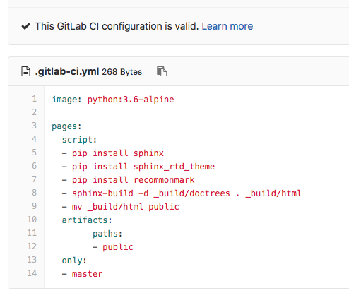

==============
Gitlab setup
==============

We set our sever up 3 years ago and did not document the steps :( BUT there is a article posted on
`Techrepublic.com <https://www.techrepublic.com/article/how-to-set-up-a-gitlab-server-and-host-your-own-git-repositories/>`_ that has all the
steps covered. Jack even included instructions for adding SSH keys so your client can talk to the GitLab server.

Gitlab prep for CI
-------------------

At this point you should have a functioning internal GitLab server.  Next step is to create a project.

  - Login to your Gitlab server.
  - Click the green button to create a new Project.

.. image:: _static/images/newproject.png

#.
 Name your project
#.
  add a project description
#.
  Select a visability level.
  **I picked Internal so anyone can contribute from our team.**
#.
  Click create project

.. image:: _static/images/newproject2.png
  :width: 75%

Creating .gitlab-ci.yml file
------------------------------

Now we have a project started and we can add a configuation file.  The .gitlab-ci.yml file needs to be in the root of the
project.

  .. Note:: YAML files are sensitive to indentation and spacing.  Do not use tab to create spaces.

  ``Touch`` and create a file called .gitlab-ci.yml

As you can see at the top of the image shows the .yml file is configured correctly.
Super, it's setup correctly, but how do we format it?

.. Note:: There is a list of reserved keywords that cannot be used to name a job.

  - ``image``
  - ``services``
  - ``stages``
  - ``types``
  - ``before_script``
  - ``after_script``
  - ``varibales``
  - ``cache``

A `job <https://docs.gitlab.com/ee/ci/yaml/README.html#jobs>`_ is defined by a list of paramaters telling the job what to do.  In our case, we want to automate our document building.
Now all the pieces are coming together.

- We have a gitlab server to host our projects containing code and documentation.
- We configured docker
- We setup our runner

We need to tell the runner what to "automate", then the runner configures the docker contaniner with our .gitlab-ci.yml setup file.
Every job needs to have a script, everything else is optional.  In our case we use ``image`` to define what OS to load in our docker container.
We chose `alpine 3.6 <https://hub.docker.com/_/alpine/>`_ which is a 5MB linux image. You can find tons of other Official repositories on `Dockers site <https://hub.docker.com/explore/>`_.

  ``Pages:`` can be any word you want to describe the job such as "poopmonster" or "job1".  The educated call it arbitrary.
  The ``script:`` builds a fresh new envirnoment everytime. Previously these steps were manual.  The CI also takes the built files and
  reloads them so all changes are immediatly available.

  ``only:`` is a list of git refs for which job is created.

  ``artifacts:`` `Artifacts <https://docs.gitlab.com/ee/ci/yaml/README.html#artifacts>`_ are a listing of files and directories where the successful job gets placed.

For more information about GitLab's CI/CD configuration `Click here <https://docs.gitlab.com/ee/ci/quick_start/README.html>`_.
