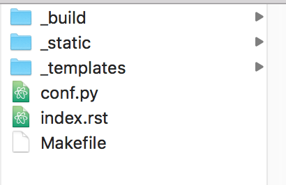
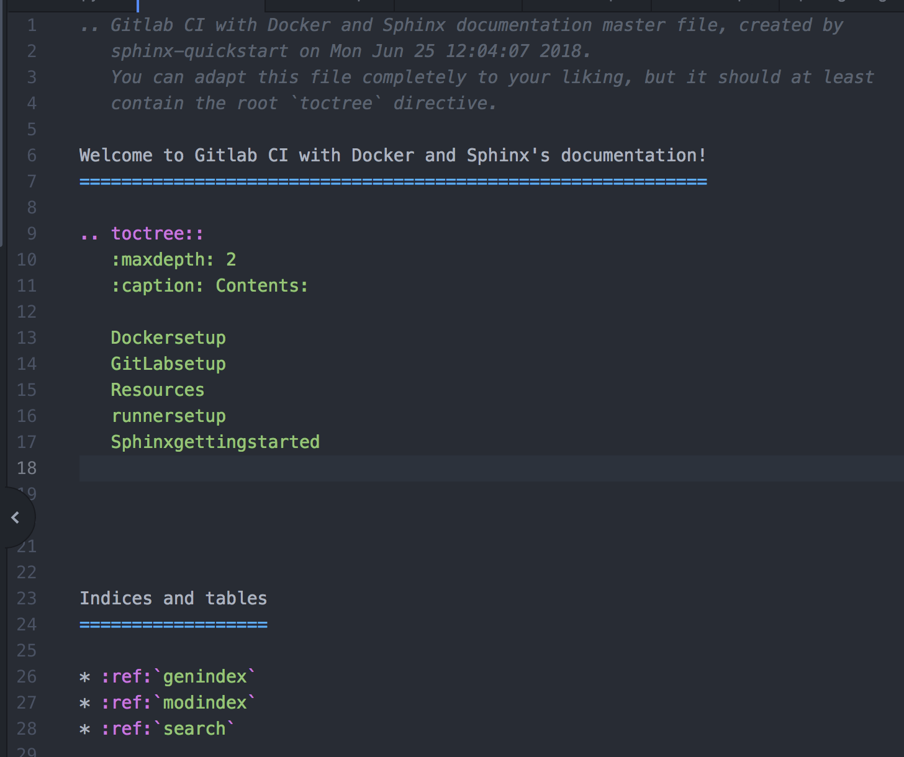

****************************
Getting started with Sphinx
****************************

While attending and `presenting <https://www.youtube.com/watch?v=1MEd8enXOUY&t=706s>`_ at Mac Admin and Developer conference, `MacAD.uk <https://www.macad.uk>`_ there was a session
`Your code should document itself! Embedding documentation into your Python projects <https://www.youtube.com/watch?v=JQ8RQru-Y9Y>`_ that interested me.
Awesome content presented by Bryson, I knew someday this would be useful.  Working on a project, people were asking for documentation explaing our processes. Like any good project,
we didn't have any centralized methodical represenation of our thoughts, why not use `Sphinx? <http://www.sphinx-doc.org/en/stable/>`_

Sphinx
-------

`Sphinx <http://www.sphinx-doc.org/en/stable/>`_ is a tool that makes it easy to create intelligent and beautiful documentation,
written by Georg Brandl and licensed under the BSD license.

Install Sphinx
----------------
``pip install sphinx``

Make a directory somewhere to house your Sphinx projects.
  ``mkdir /place/to/store/sphinx/docs``
Change into your new directory.
  ``cd /place/where/you/stored/sphinx/docs``
Next start your project by running
  ``sphinx-quickstart``

Setting up your Sphinx project
--------------------------------

After runnin ``sphinx-quickstart`` you should see the following output.

.. image:: _static/images/sphinx-quickstart.png

the default setting is in ``[]`` , press return for the default setting.

- Follow along with the promts that get outputted after your selections.

- Name the project
- Add the author and give the project a version number.

.. image:: _static/images/projectnameSphinx.png

After completing all the prompts, I suggest creating the Makefile.

.. image:: _static/images/sphinxdone.png

Congrats!! your first sphinx project is now started!

Working with your new Sphinx project
-------------------------------------

Navagate to the directory you setup for your documentation, and you should see something similar:

I use `atom <https://atom.io>`_ to edit the ``conf.py`` and ``index.rst`` files.  There are plenty of editors you
can choose from such as `Sublime <https://www.sublimetext.com>`_ or `BBedit <https://www.barebones.com>`_.

  - Open terminal and ``cd`` to the project directory.

  - Next let's create some ``.rst`` files to get our documentation started.

  - While in the current project directory, ``touch mysphinxdirections.rst`` to create a Restructured Text file.

I'd create a couple of files to get started.  For example, some docs used to create this project are called

  - sphinxgettingstarted.rst
  - GitLabsetup.rst
  - runnersetup.rst

**Avoid spaces,** and try to keep the filename relevant to it's function.

Open your editor and open your project.  Open your ``.rst`` files and give them a title heading.

.. image:: _static/images/heading.png
  :width: 49%

Make sure to save the files after adding the heading.

Next open your index.rst, and add the ``.rst`` files you touched in the terminal.

.. Note:: Don't add the file extension ``.rst`` to the index list.

At this point, we have

  - Installed Sphinx.
  - created a Sphinx project.
  - created .rst files for our project.
  - added .rst filenames to the index.rst

Now that we have some content configured, let's build some documentation!

Building your Sphinx project
-----------------------------

With the base of our project configured, we can generate some html content to view what we've started.
Head back to your terminal application for the next step.

  ``sphinx-build [options] <source directory> <output directory> [filenames]``

If no output directory is listed, the output defaults to the source.

  ``sphinx-build /path/to/my/sphinx/project/ html``

will result in the following output.

.. image:: _static/images/buildoutput.png

Head back to the finder and locate your source directory and locate the new HTML directory.

.. image:: _static/images/html.png
  :width: 50%

Double click on the index.html file, and a web browser will display your project.

.. image:: _static/images/projecthtml.png

`shpinx-build man page and additional options <http://www.sphinx-doc.org/en/master/man/sphinx-build.html>`_

Doesn't that look purdy?  I'm not a designer, and with minimal effort I have a resource that looks nice!
Yes, yes that does look nice, why doesn't my project look like that?

Sphinx Themes
--------------

A theme is a collection of HTML templates, stylesheets and other files.  A theme keeps the HTML appearance
consistant throughout the project making it look good.

In our example project, we are using ``sphinx_rtd_theme``.

Setting up a Theme
-------------------

Open your text editor and navigate back to the source directory.  Locate the ``conf.py`` and open it for modification.
Sphinx has some `built in themes <http://www.sphinx-doc.org/en/master/theming.html?highlight=themes>`_ you can use setting the ``html_theme`` config value in your ``conf.py``.

- Search ``conf.py`` for ``html_theme``, enter the value ``sphinx_rtd_theme`` and save the script.

  .. image:: _static/images/theme.png

- Open terminal and install the theme ``pip install sphinx_rtd_theme``

Save all your work.

Re-build your project, and refresh your browser and now you should see the blue and black theme.
